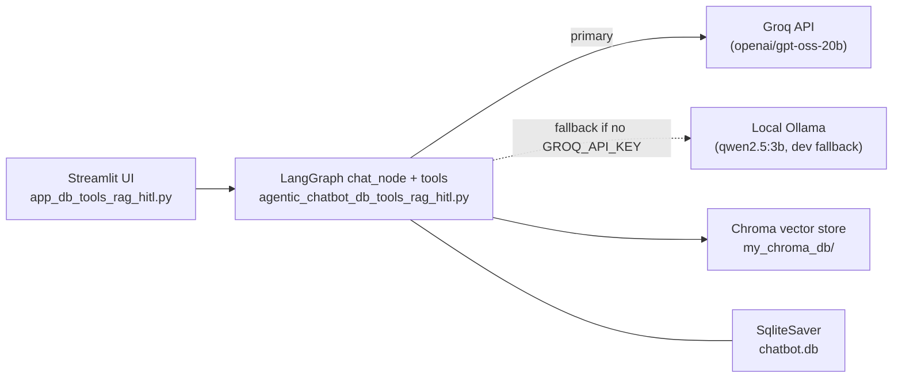

# Agentic AI Chatbot

A tool-calling chatbot built on LangGraph and Streamlit, with document upload
(RAG), human-in-the-loop (HITL) approval for sensitive actions, resume/ATS
tooling, and persistent multi-thread conversation history via SQLite.

The current app is **`app_db_tools_rag_hitl.py`**, backed by
**`agentic_chatbot_db_tools_rag_hitl.py`**.

## Architecture



- **UI (Streamlit)**: chat bubbles, sidebar thread list, file upload
  (PDF/DOCX/TXT), streaming responses with live tool-progress status, and a
  human-in-the-loop approve/reject panel for tools that pause mid-run.
- **LangGraph**: a `chat_node` + `tools` graph (`tools_condition` routes
  between them) with SQLite-backed checkpointing, so conversations and
  in-progress HITL interrupts survive across turns and restarts.
- **Model backend**: **Groq** (`openai/gpt-oss-20b`) is the primary LLM —
  fast, and the only backend that works on a cloud host like Render, since
  it needs no local model daemon. If `GROQ_API_KEY` isn't set/valid, the app
  falls back to a local **Ollama** model (`qwen2.5:3b`) for offline dev use
  only; this fallback does not work on Render.
- **RAG / document tools**: uploaded resumes/documents are chunked with a
  size-adaptive splitter (`pick_chunker_strategy` — small/medium/large/huge
  tiers based on page count) and embedded into a local Chroma vector store
  for retrieval.
- **HITL**: sensitive or multi-step actions (stock purchases, adding an
  ATS-boosting statement to a resume, choosing a docx/pdf export) pause the
  graph via `interrupt()` and resume via `Command(resume=...)` once the user
  clicks Approve/Reject in the UI. A small step registry
  (`register_hitl_step`) lets one approval dynamically chain into the next
  checkpoint instead of hardcoding a fixed sequence per tool.
- **Progress/ETA reporting**: long-running tools report live "done / doing /
  next / ETA" status via a registered stage list (`register_progress_stages`)
  streamed to the UI through LangGraph's custom stream mode, so a slow tool
  call shows real progress instead of an unexplained pause.

## Tools available to the model

| Tool | Purpose |
|---|---|
| `get_stock_price` | Current stock price lookup (Alpha Vantage) |
| `search_tool` | Web search (Tavily) |
| `calculator` | Arithmetic evaluation |
| `get_weather` | Current/forecast weather (Open-Meteo) |
| `rag_tool` | Answers factual questions from an uploaded document |
| `ats_score_tool` | Scores an uploaded resume for ATS compatibility |
| `resume_review_tool` | Reviews/rewrites/tailors a resume to a job description (searches the web for a JD if none is given), with an HITL checkpoint before finalizing |
| `purchase_tool` | Mock stock purchase, gated behind human approval (HITL) |

## Setup

### Requirements
```bash
pip install -r requirements.txt
```

### Environment variables

Create a `.env` file in this folder (never commit it — see `.gitignore`):

```env
GROQ_API_KEY=your_groq_api_key      # required for the primary (fast) model
TAVILY_API_KEY=your_tavily_api_key  # required for search_tool
STOCK_API_KEY=your_alphavantage_key # required for get_stock_price

# optional: only used for local offline dev if Groq isn't configured
# (requires Ollama running locally with `qwen2.5:3b` pulled)
```

Get a Groq key at [console.groq.com](https://console.groq.com).

### Run locally
```bash
streamlit run app_db_tools_rag_hitl.py
```

## Deploying on Render

1. Create a new **Web Service** on Render, pointed at this repo.
2. **Build command**: `pip install -r agentic_chatbot/requirements.txt`
3. **Start command**:
   ```
   streamlit run agentic_chatbot/app_db_tools_rag_hitl.py --server.port $PORT --server.address 0.0.0.0
   ```
4. **Environment variables** (Render dashboard → Environment, not `.env` —
   `.env` is gitignored and won't exist on the deployed instance):
   - `GROQ_API_KEY`
   - `TAVILY_API_KEY`
   - `STOCK_API_KEY`
5. Deploy. Since Ollama cannot run on Render, `GROQ_API_KEY` **must** be set
   and valid, or the app will fail to start (`No model is available.
   Closing...`).

## Known limitations

- The local-Ollama fallback only works on a machine with Ollama installed
  and running; it is unreachable on Render or any host without an Ollama
  daemon.
- The Chroma vector store (`my_chroma_db/`) is local disk storage — on
  Render's ephemeral filesystem, uploaded documents/embeddings do not
  persist across deploys or restarts.
- `docx`/`pdf` export for tailored resumes is offered as a choice through
  the HITL flow, but only the `.txt`/`.md` download is currently generated;
  the docx/pdf file itself is not yet produced.
