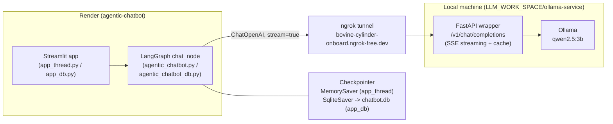

# Agentic AI Chatbot

A Streamlit chatbot built on LangGraph, backed by a local Ollama model exposed
through a self-hosted OpenAI-compatible API (tunneled with ngrok), deployed on
Render.

## Architecture

- **UI (Streamlit)**: renders chat bubbles, sidebar thread list, and streams
  tokens as they arrive via `st.write_stream`.
- **LangGraph**: a single-node graph (`chat_node`) that invokes the LLM and
  appends the response to conversation state.
- **Checkpointer**: `app_thread.py` uses an in-memory `MemorySaver` (state
  lost on restart); `app_db.py` uses `SqliteSaver` against `chatbot.db`, so
  conversations survive app restarts and can be listed via `get_all_threads()`.
- **Model backend**: `ChatOpenAI` pointed at a local FastAPI wrapper
  (`ollama-service/app.py`) that proxies an Ollama model, exposed to the
  internet via a static ngrok domain. The deployed app therefore only answers
  while the local machine, Ollama, and the ngrok tunnel are all running.

## Build stages

The project was built up in four stages, each adding one capability on top
of the last.

### 1. Core chatbot on LangGraph
- `53cb5aa` First version: a single-node LangGraph graph (`chat_node`) that
  takes the conversation state, invokes an LLM (local Ollama or an
  OpenAI-compatible endpoint via `ChatOpenAI`), and appends the response.
  No UI yet — just the graph definition.

### 2. Persistent (short-term) memory via checkpointing
- Added a `MemorySaver` checkpointer so the graph remembers prior turns
  within a `thread_id` — the graph looks up state by thread and appends new
  messages rather than starting fresh each call.
- `25741d3` Introduced multiple conversation threads: `app_thread.py` lets a
  user switch between threads, each with its own `thread_id` and isolated
  message history (still in-memory — lost on restart).

### 3. User interface (Streamlit)
- Built the Streamlit UI on top of the graph: chat bubbles, a text input,
  and a sidebar listing all threads with a "New Chat" button
  (`app_simple.py` → `app_thread.py`).
- `40ee246` Made the app deployable: fixed model selection (`ChatOllama`
  construction never actually failed, so it never fell back to the online
  model — gated behind `USE_LOCAL_MODEL`) and filled in the real
  `langgraph`/`langchain` dependencies in `requirements.txt`.
- Deployed to **Render** (`agentic-chatbot`,
  `https://agentic-chatbot-wah3.onrender.com`), running
  `streamlit run agentic_chatbot/app_thread.py`.
- `a6f2a09` → **streaming fix**: hit `ValueError: No generations found in
  stream` in production — the local `ollama-service` wrapper always
  returned one flat JSON body regardless of the `stream` flag, breaking
  `ChatOpenAI`'s SSE parser. Implemented real SSE streaming in
  `ollama-service/app.py` (proxies Ollama's streamed response as OpenAI-style
  `data: {...}` chunks), then `b58189f` re-enabled streaming in the client.
- `18b2ecc` / `0d0fc17` → UI polish: derived a short chat title from each
  thread's first message instead of showing the raw UUID in the sidebar
  (with a `st.rerun()` fix so it refreshes promptly), and added ChatGPT-style
  message alignment (user right, assistant left) via CSS on Streamlit's
  `data-testid` hooks.

### 4. Long-term memory via SQLite
- Added `agentic_chatbot_db.py` and `app_db.py`, swapping `MemorySaver` for
  `SqliteSaver` against `chatbot.db`. Conversation state now survives app and
  server restarts, and `get_all_threads()` reads every known thread straight
  from the database to populate the sidebar — not just threads created in
  the current session.

## Tests performed

- **Backend health check**: `curl https://bovine-cylinder-onboard.ngrok-free.dev/health`
  → confirms the ngrok tunnel, FastAPI wrapper, and Ollama are all reachable
  and lists available models.
- **Non-streaming regression check**: `curl -X POST .../v1/chat/completions`
  with `"stream": true` — reproduced the bug (server returned one flat JSON
  object instead of SSE chunks), which is what led to the `ChatOpenAI`
  streaming crash.
- **Streaming fix verification**: re-ran the same curl after patching
  `ollama-service/app.py` — confirmed proper `data: {...}` chunks per token
  followed by `data: [DONE]`.
- **Render deploy checks**: after every push, checked deploy status
  (`build_in_progress` → `live`) and tailed build/app logs to catch install
  or runtime errors early (e.g. the missing dependencies in
  `requirements.txt`, and the streaming traceback).
- **UI verification with Playwright**: launched the app locally
  (`streamlit run app_thread.py`), drove a headless Chromium browser to
  submit a real chat message, and inspected both the rendered DOM
  (`data-testid="stChatMessage"` / `chatAvatarIcon-user"`) and a full-page
  screenshot to confirm:
  - user messages render right-aligned with the avatar on the right;
    assistant messages stay left-aligned;
  - the sidebar shows the derived chat title instead of the raw thread UUID
    immediately after the first exchange.

## Known limitations

- The deployed app's model backend is a **local machine + ngrok tunnel**,
  not a hosted service — chat requests fail whenever Ollama or the tunnel are
  down.
- `app_thread.py` keeps conversation history in memory only (lost on
  restart); use `app_db.py` for persistence across restarts.
