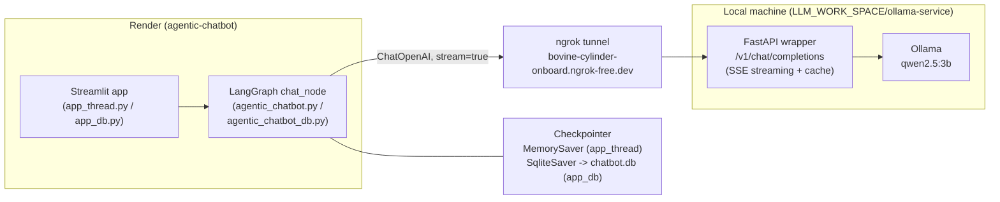

# Agentic AI Chatbot

A Streamlit chatbot built on LangGraph, backed by a local Ollama model exposed
through a self-hosted OpenAI-compatible API (tunneled with ngrok), deployed on
Render.

## Architecture

- **UI (Streamlit)**: renders chat bubbles, sidebar thread list, and streams
  tokens as they arrive via `st.write_stream`.
- **LangGraph**: a single-node graph (`chat_node`) that invokes the LLM and
  appends the response to conversation state.
- **Checkpointer**: `app_thread.py` uses an in-memory `MemorySaver` (state
  lost on restart); `app_db.py` uses `SqliteSaver` against `chatbot.db`, so
  conversations survive app restarts and can be listed via `get_all_threads()`.
- **Model backend**: `ChatOpenAI` pointed at a local FastAPI wrapper
  (`ollama-service/app.py`) that proxies an Ollama model, exposed to the
  internet via a static ngrok domain. The deployed app therefore only answers
  while the local machine, Ollama, and the ngrok tunnel are all running.

## Day-by-day log

### 2026-08-26 — Initial chatbot + graph
- `53cb5aa` Added the first version of the chatbot: a LangGraph single-node
  graph (`chat_node`) wired to either a local Ollama model or an OpenAI-compatible
  endpoint, plus a first Streamlit app.

### 2026-08-27 — Threading, deployment, and streaming fixes
- `25741d3` Split the app into `app_simple.py` and `app_thread.py` (per-thread
  conversations with a sidebar), added `requirements.txt` and a scoped
  `.gitignore` for the module.
- `40ee246` Fixed model selection for deployment: `ChatOllama(...)` never
  raised on construction, so the app always picked the local model and never
  fell back to the online endpoint. Gated selection behind `USE_LOCAL_MODEL`.
  Filled in the real `langgraph`/`langchain` dependencies in
  `requirements.txt` (previously only `streamlit` was listed).
- Deployed to **Render** as a web service (`agentic-chatbot`,
  `https://agentic-chatbot-wah3.onrender.com`), running
  `streamlit run agentic_chatbot/app_thread.py`.
- `a6f2a09` Diagnosed a production crash — `ValueError: No generations found
  in stream` — traced to the local `ollama-service` wrapper always returning
  a single JSON body regardless of the `stream` flag, which broke
  `ChatOpenAI`'s SSE parser. Temporarily disabled streaming as a hotfix.
- Implemented **real SSE streaming** in `ollama-service/app.py`: proxies
  Ollama's own streamed `/api/chat` response, converts each chunk into
  OpenAI-style `data: {...}` deltas, and terminates with `data: [DONE]`;
  cached answers are replayed as a single-chunk stream.
- `b58189f` Re-enabled streaming in `agentic_chatbot.py` now that the backend
  genuinely supports it; verified end-to-end with a live curl test against
  the ngrok URL.
- `18b2ecc` Sidebar showed raw thread UUIDs — added `thread_titles`, deriving
  a short title from each thread's first user message.
- `0d0fc17` Fixed the title not refreshing until an unrelated rerun (missing
  `st.rerun()` after the assistant reply), and added ChatGPT-style message
  alignment (user messages right-aligned with the avatar on the right,
  assistant messages left-aligned) via CSS targeting Streamlit's
  `data-testid` hooks.
- Added a **SQLite-backed variant** (`agentic_chatbot_db.py`, `app_db.py`)
  using `SqliteSaver` so conversation history survives app/server restarts,
  with `get_all_threads()` populating the sidebar from the database instead
  of only the current session.

## Tests performed

- **Backend health check**: `curl https://bovine-cylinder-onboard.ngrok-free.dev/health`
  → confirms the ngrok tunnel, FastAPI wrapper, and Ollama are all reachable
  and lists available models.
- **Non-streaming regression check**: `curl -X POST .../v1/chat/completions`
  with `"stream": true` — reproduced the bug (server returned one flat JSON
  object instead of SSE chunks), which is what led to the `ChatOpenAI`
  streaming crash.
- **Streaming fix verification**: re-ran the same curl after patching
  `ollama-service/app.py` — confirmed proper `data: {...}` chunks per token
  followed by `data: [DONE]`.
- **Render deploy checks**: after every push, checked deploy status
  (`build_in_progress` → `live`) and tailed build/app logs to catch install
  or runtime errors early (e.g. the missing dependencies in
  `requirements.txt`, and the streaming traceback).
- **UI verification with Playwright**: launched the app locally
  (`streamlit run app_thread.py`), drove a headless Chromium browser to
  submit a real chat message, and inspected both the rendered DOM
  (`data-testid="stChatMessage"` / `chatAvatarIcon-user"`) and a full-page
  screenshot to confirm:
  - user messages render right-aligned with the avatar on the right;
    assistant messages stay left-aligned;
  - the sidebar shows the derived chat title instead of the raw thread UUID
    immediately after the first exchange.

## Known limitations

- The deployed app's model backend is a **local machine + ngrok tunnel**,
  not a hosted service — chat requests fail whenever Ollama or the tunnel are
  down.
- `app_thread.py` keeps conversation history in memory only (lost on
  restart); use `app_db.py` for persistence across restarts.
